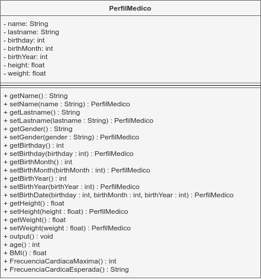

# Trabajando Clases

Luis Ángel Serrano Catalá | Prof. Ricardo Vegas Morales

Programación Orientada a Objetos, Unidad 3.

LIDTS 2°P, Universidad Autónoma de Chiapas.

---

## Diagrama

## Terminal

